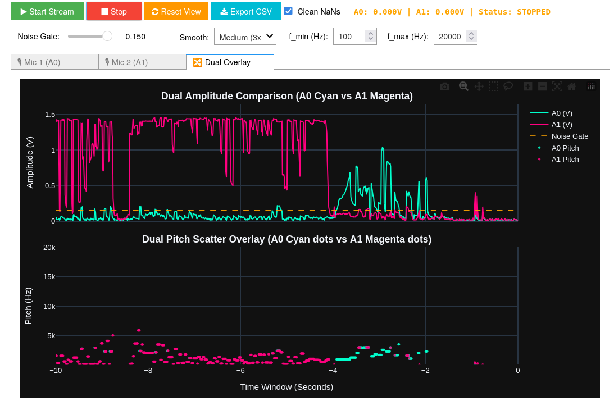

# Real-Time Acoustic Kinematics, Doppler Tracking & Sound Localizer on PYNQ-Z2

[](https://pypi.org/project/pynq-sound-localizer/)
[](LICENSE)
[](https://github.com/SiririComun/hw-xadc-dma-overlays)
[](https://tul.com.tw/ProductsPYNQ-Z2.html)

A high-performance FPGA-accelerated acoustic processing platform on the **PYNQ-Z2 board (`xc7z020clg400-1`)** providing **true simultaneous dual-ADC parallel sampling ($0.00\,\mu\text{s}$ inter-channel skew)**, **$20\,\text{Hz} - 20\,\text{kHz}$ sub-Hertz fundamental pitch tracking**, **real-time 10-second rolling dual-telemetry curves**, and multi-second continuous flight recording for Doppler kinematics.

---

## 🏛 System Architecture

The package automatically downloads its pre-compiled hardware bitstream (`v1.5.0`) and metadata from GitHub Releases into local cache and encapsulates the dual DMA receivers, XADC parallel sequencer, hardware decimators, and telemetry engines into a clean Python API.

```
 [ MAX4466 Mic 1 ] ─────────────────────────> [ PYNQ-Z2 Pin A0 (Vaux1) ]
 [ MAX4466 Mic 2 ] ─────────────────────────> [ PYNQ-Z2 Pin A1 (Vaux9) ]
                                                            │
                                             (XADC Dual Continuous Sequencer)
                                             (1 MSPS Interleaved Stream, 0.00 µs Skew)
                                                            ▼
                                                  [ axis_decimator IP ]
                                                (FPGA Anti-Aliasing M=10)
                                                            │ (50 kSPS Decimated Audio Stream)
                                                            ▼
                                                  [ AXI DMA 0 (Time) ]
                                                            │
                                                            ▼ (DDR Memory)
                                               [ MicrophoneArrayOverlay ]
                                      ├── .trigger               (HardwareTrigger AXI-Lite)
                                      ├── .capture_frame()       (0.00 µs Synchronous Snapshot)
                                      ├── .record_continuous()   (Multi-Second Flight Logger)
                                      ├── .play_audio()          (Jupyter Audio Playback)
                                      └── .kinematics_dashboard()(10s Rolling Real-Time GUI)
```

---

## 🎛 Real-Time 10-Second Rolling Telemetry Dashboard

The flagship **`KinematicsDashboard`** uses a decoupled two-thread architecture ($100\,\text{Hz}$ background DSP worker + $30\,\text{FPS}$ Plotly rendering) to display real-time physical telemetry without browser lag:

* **Row 1 (Amplitude vs. Time):** Instantaneous smoothed RMS acoustic loudness envelope $A(t)$ in physical Volts with an active noise gate threshold.
* **Row 2 (Frequency vs. Time):** Sub-Hertz fundamental pitch trajectory $f_0(t)$ ($20\,\text{Hz} - 20\,\text{kHz}$) with moving median reflection filtering and noise squelch gating.
* **3-Tab Synchronized View:** Dedicated **Mic 1 (A0)**, **Mic 2 (A1)**, and **Dual Comparison Overlay**.
* **Clean CSV Export:** Exports 10-second synchronized data without `NaN` values directly to disk.



---

## 🔌 Hardware Setup & Physical Pin Constraints

Connect two analog electret microphones (such as Adafruit **MAX4466** or MAX9814) to the PYNQ-Z2 Arduino Header **`J1`**:

| Microphone Pin | PYNQ-Z2 Connection | Header Location | Description |
| :--- | :--- | :--- | :--- |
| **`VCC`** (Both Mics) | **`3.3V`** | Power Header | Clean analog supply voltage |
| **`GND`** (Both Mics) | **`GND`** | Power Header | Common system analog ground |
| **`OUT` (Mic 1)** | **Header `J1` Pin A0** | Pin 6 (Bottom) | Channel 1 Analog Input (`Vaux1`, pins `E17`/`D18`) |
| **`OUT` (Mic 2)** | **Header `J1` Pin A1** | Pin 5 (2nd from Bottom) | Channel 2 Analog Input (`Vaux9`, pins `E18`/`E19`) |

---

## 🚀 Quick Start & Installation

### 1. Install from PyPI (or GitHub)
```bash
pip install --upgrade pynq-sound-localizer
```

### 2. Copy Example Notebooks to Jupyter Workspace
```bash
pynq-localizer-get-notebooks
```

---

## 💻 Python API Usage

### 1. Launch the Live 10-Second Rolling Dashboard
```python
from pynq_localizer import MicrophoneArrayOverlay

# Auto-downloads and loads the pinned v1.5.0 bitstream
ol = MicrophoneArrayOverlay()

# Launch the live interactive multi-tab instrument
app = ol.kinematics_dashboard()
```

### 2. Direct Clean Data Handoff in Jupyter
```python
# Extract clean non-NaN telemetry arrays directly from the dashboard
t_sec, amp_v, freq_hz = app.get_clean_data(channel=1)

print(f"Captured {len(t_sec)} clean motion points!")
print(f"Observed Doppler frequency span: {freq_hz.min():.1f} Hz -> {freq_hz.max():.1f} Hz")
```

### 3. Continuous Multi-Second Flight Recording
```python
# Record 5.0 seconds of continuous 50 kSPS dual-channel flight data
t_axis, v_mic1, v_mic2 = ol.record_continuous(duration_sec=5.0)

# Listen to captured audio directly in Jupyter
ol.play_audio(channel=1)
```

---

## 📄 License

This project is licensed under the MIT License - see the [LICENSE](LICENSE) file for details.